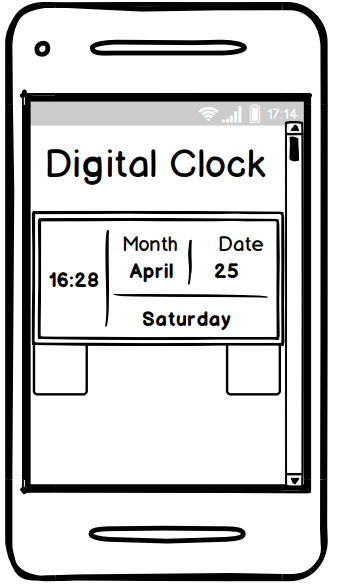
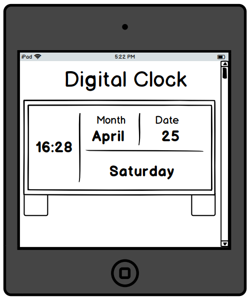
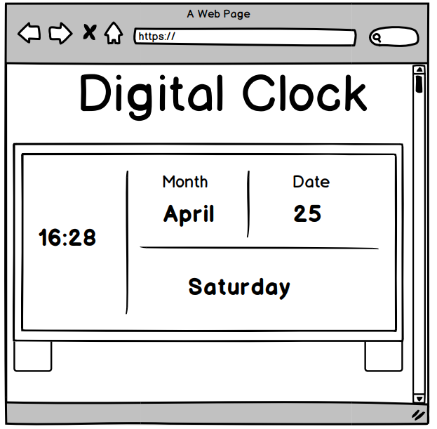

# Digital Clock

This project is a 24-hour digital clock that displays the current time when opened and refreshed. The clock shows hours, minutes and seconds to tell the time. The project also displays the current month and its date as well as the current day of the week. The aim of this project is to provide users, who come across this website, a means to be informed on the current time, day and date.

# UX

### User Stories

- As a user, I want to be informed on the date, day and time when I approach this website.
- As a user, I want to get an updated version on the current date, day and time when using this website.

### Designer Goals

- As the designer, I want to ensure the current date, day and time are displayed on the clock so the user can see it as soon as they approach the website.
- As the designer, I want to ensure the date, day and time update accordingly when the website is refreshed, so the user can be informed with the most accurate information.

### Wireframes

# Features

- The part of the digital clock that displays the hours, minutes and seconds allows users to see the current time when they approach the website.
- The month section of the digital clock allow users to see the current month and date of the month when they approach the website.
- The weekday section of the digital clock allow users to see the current day of the week when they approach the website.

# Testing

- Responsiveness
  1. Open Chrome DevTools at the following screen sizes:
     1. 320px X 667px
     2. 576px X 667px
     3. 768px X 667px
     4. 992px X 667px
     5. 1366px X 667px
  2. Ensure the digital clock and its contents are clearly visible and legible across each of these screen sizes.
  3. If not, adjust the CSS accordingly using Chrome DevTools to preview the edits before entering them in the Sass file.
  4. Re-check the responsiveness using Chrome DevTools to ensure the contents are visible and legible across each of these screen sizes.
  5. Repeat steps 3 and 4 until the project is fully responsive.
- Time
  1. Enter the website and ensure the time is displayed on the left-hand side of the clock's screen.
  2. Compare the time shown in the project with the a another live clock and ensure the times shown are the same.
  3. Check the hours, minutes and seconds can all be seen on the clock.
  4. Ensure the clock makes use of the 24-hour model by checking the time shows 13:00 and not 01:00 when it's 1pm.
- Month & Date
  1. Check the correct month and date are shown on the clock.
  2. Ensure the month and date are displayed on the right-hand side of the clock.
  3. Ensure the month and date can be easily read and clearly visible.
  4. Check the "**_Month_**" and "**_Date_**" titles do not overlap with the current month and date displayed underneath.
- Weekday
  1. Check the day of the week appears on the right-hand side and underneath the month and date.
  2. Ensure the correct day of the week shows on the clock.
  3. Check the day of the week is easy to read for each day, using Chrome DevTools.
  4. Click the "**_Elements_**" tab and enter "**_Wednesday_**" into the paragraph with the "**_weekday_**" id to check the day with the most amount of characters will fit in the clock.

# Technologies Used

- [HTML5](https://developer.mozilla.org/en-US/docs/Web/Guide/HTML/HTML5)
  - HTML5 was used to create the basic structure of the digital clock's code.
- [CSS3](https://www.tutorialrepublic.com/css-tutorial/)
  - CSS3 was used to add styling to the HTML5 code, regarding the colours, border shaping, font sizes, etc.
- [Sass](https://sass-lang.com/)
  - Sass was used to organise the CSS3 code and make it easier to read and edit when changes were made.
- [JavaScript](https://www.javascript.com/)
  - JavaScript was used in this project to provide the logic of the clock and enable DOM manipulation so the time, date and day would be changed.
- [Google Fonts: "Roboto Mono"](https://fonts.google.com/specimen/Roboto+Mono?sidebar.open=true&selection.family=Roboto+Mono)
  - The "Roboto Mono" from Google Fonts was used to change the font style so it resembled the look of a standard digital clock.
- [Chrome DevTools](https://developers.google.com/web/tools/chrome-devtools)
  - Chrome DevTools was used to debug errors with the JavaScript code using "**_console.log()_**", in the "**_Console_**" tab.
  - Chrome DevTools was used to check the Responsiveness of the digital clock across different screen sizes.
  - Chrome DevTools was used to ensure the correct data was being appended to the HTML file using the "**_Elements_**" tab.

# Deployment

The following stages are to be conducted in order to deploy the website:

1. Enter into the logged in GitHub account and click on the "**_Repositories_**" tab.
2. Select the repository from the list that is to be deployed.
3. Click on the "**_Settings_**" tab.
4. Scroll down to "**_GitHub Pages_**" then click on the button labelled "**_None_**" under the "**_Source_**" title.
5. Select "**_main_**" then select the "**_Save_**" button besides it.
6. After the page refreshes, scroll back down to "**_GitHub Pages_**" and click on the provided link where the website has been published.
7. The project has been successfully deployed as a website for all users to see.

# Running the code locally

The following stages are to be conducted in order to run the project's code locally:

1. Enter into the logged in GitHub account and click on the "**_Repositories_**" tab.
2. Select the repository from the list who's code is to be ran locally.
3. Click on the "**_Code_**" button.
4. Click on the clipboard besides the URL to copy the link.
5. Open the text editor of choice e.g VS Code, and select "**_Clone Repository_**".
6. Paste the copied link in the "**_Clone Repository_**" search bar and press "**_enter_**" on the keyboard to create the local clone.

# Credits

### Content

- The responsive breakpoints from 320px-992px used were inspired by Bootstrap.

### Acknowledgements

- I received inspiration for this project from:
  - https://www.google.com/search?q=digital+clocks&tbm=isch&ved=2ahUKEwirw_Lyy_jtAhUSNhoKHehNB_AQ2-cCegQIABAA&oq=digital+clocks&gs_lcp=CgNpbWcQAzIECAAQQzIECAAQQzICCAAyAggAMgIIADICCAAyAggAMgIIADIECAAQQzIECAAQQ1DEPVjEPWDoPmgAcAB4AIABR4gBR5IBATGYAQCgAQGqAQtnd3Mtd2l6LWltZ8ABAQ&sclient=img&ei=9vXtX6vwLpLsaOibnYAP&bih=657&biw=917&rlz=1C1CHBF_en-GBGB905GB905#imgrc=uIlgyAyRNdfgBM
  - https://www.youtube.com/watch?v=_a5j7KoflTs&t=983s&ab_channel=freeCodeCamp.org
  - https://www.w3schools.com/jsref/jsref_gethours.asp
  - https://www.w3schools.com/jsref/jsref_getminutes.asp
  - https://www.w3schools.com/jsref/jsref_getseconds.asp
